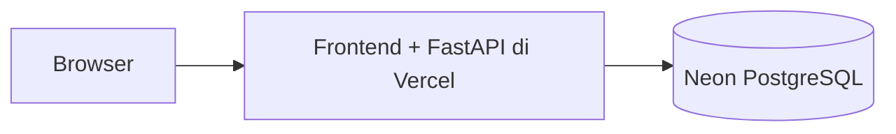

# CRM Business — full-stack portfolio edition

CRM B2B untuk belajar alur **Lead → Company + Contact → Opportunity → Won/Lost**. Tampilan HTML/CSS/JavaScript asli dipertahankan; data dan business rules kini memakai FastAPI, PostgreSQL, SQLAlchemy, serta Alembic. Tidak ada AI, pembayaran, invoicing, WhatsApp, atau email automation.

**Status:** backend dan database PostgreSQL lokal tersedia. Deployment full-stack Neon/Vercel belum dilakukan karena proyek Neon belum dibuat. URL Sites sebelumnya adalah demo v1, bukan deployment backend v2. Ini proyek portfolio, bukan klaim enterprise security atau production readiness.

**Source code publik:** [justinchristroper-arch/crm-business](https://github.com/justinchristroper-arch/crm-business), branch `main`. [CI quality gates](https://github.com/justinchristroper-arch/crm-business/actions) telah memverifikasi 29 test backend, 3 test frontend, lint, build aset, dan migrasi tanpa drift pada PostgreSQL disposable.

**Publikasi Phase 3:** proyek Vercel Hobby `justin-c/crm-business` sudah dibuat dan GitHub terhubung. Provisioning Neon Free menunggu pemilik akun menerima syarat Marketplace/Neon. Belum ada deployment, migration/seed Neon, hosted acceptance verification, atau screenshot produksi. Lihat [status Phase 3](docs/PHASE3.md).

## Ringkasan portfolio

**Masalah bisnis:** studio web fiktif membutuhkan satu tempat untuk memantau calon klien, peluang penjualan, dan follow-up beberapa sales rep, dengan aturan akses dan riwayat perubahan yang konsisten.

**Tech stack:** HTML/CSS/JavaScript ES modules, Python/FastAPI, SQLAlchemy, PostgreSQL, Alembic, Argon2id, JWT cookie, Node.js tests, pytest, ESLint, Ruff. Target hosting: frontend/API satu origin di Vercel, database Neon PostgreSQL.

| Role | Cakupan |
|---|---|
| Sales Representative | Data milik sendiri atau ditugaskan kepadanya |
| Sales Manager | Pipeline dan performa tim; perubahan outcome pihak lain wajib disertai alasan |
| Admin | Pengguna, konfigurasi, dan data sistem; perubahan tetap diaudit |

Sorotan teknis: konversi lead dalam satu transaksi; ownership/role diperiksa server; stage/value/owner changes tercatat dalam audit PostgreSQL; metrik Manager memakai definisi backend yang terdokumentasi.

**Live demo v2:** belum tersedia. **Screenshot produksi:** belum diambil. Keduanya akan ditambahkan setelah deployment dan hosted acceptance verification berhasil; screenshot lokal/v1 tidak digunakan sebagai bukti produksi v2.



Diagram tersebut adalah target deployment; database yang sudah diverifikasi saat ini adalah PostgreSQL lokal.

## Jalankan lokal

Prasyarat: Python 3.12+, Node.js 24+, PostgreSQL 17 atau Docker.

```sh
python -m venv .venv
```

Aktifkan virtualenv (`.venv\Scripts\Activate.ps1` di PowerShell, `source .venv/bin/activate` di Linux/macOS), lalu:

```sh
pip install -r requirements-dev.txt
npm ci
```

Salin `.env.example` ke `.env` yang di-ignore Git. Isi database PostgreSQL, JWT secret acak minimal 32 karakter, serta origin lokal. Jangan gunakan secret development untuk production. Untuk Docker, isi POSTGRES_PASSWORD dan jalankan `docker compose up -d db`.

Pada workspace Windows yang disiapkan selama pengerjaan, `.env` sudah tersedia dan menunjuk cluster **terpisah** di `artifacts/postgres`, port **55432**, loopback-only. Cluster ini tidak memakai/mengubah service PostgreSQL pengguna. Mulai lagi dengan `./scripts/local-postgres.ps1 start`. Cluster disposable ini memakai trust auth; jangan gunakan konfigurasi tersebut pada server publik.

Setelah database/env siap:

```sh
alembic upgrade head
python -m backend.seed
npm run dev
```

Buka **http://localhost:8000**. Frontend/API berbagi origin. Seed membutuhkan DEMO_MODE=true, bersifat idempotent, dan tidak dijalankan otomatis pada startup/build/request.

## Akun demo fiktif

| Role | Email |
|---|---|
| Sales Rep | `rep@crm-demo.example` |
| Sales Rep kedua | `rep2@crm-demo.example` |
| Sales Manager | `manager@crm-demo.example` |
| Admin | `admin@crm-demo.example` |
| Sales tim lain | `other@crm-demo.example` |

Password bawaan semua akun: **PortfolioDemo!2026**, hanya untuk demo; jangan digunakan di sistem nyata. DEMO_PASSWORD dapat diubah sebelum seed pertama, tetapi perubahan env tidak mengganti password akun yang sudah ada. Tombol login demo hanya tampil saat demo mode aktif dan password bawaan digunakan.

Akun demo bersama, terutama Admin, memberi pengunjung kontrol atas data fiktif bersama. Jangan masukkan data pelanggan/personalia sungguhan.

## Fitur

- Dashboard/laporan berbasis role dengan perhitungan backend.
- Perusahaan, kontak, lead, opportunity, dan tugas dengan owner/assignee.
- Konversi lead transactional dan deduplikasi dalam cakupan owner.
- Kanban, alasan Lost, close timestamp, reopen, revision checks.
- Follow-up, overdue, At Risk, serta audit immutable untuk aplikasi.
- Manager: pipeline/won value per rep, conversion rate, average sales cycle.
- Admin: user/role/tim/status, workspace, konfigurasi batas At Risk.
- CSV, backup JSON, impor transactional append, reset khusus data fiktif tanpa menghapus audit.
- Desain lama tetap digunakan; login/perusahaan/pengguna mengikuti gaya yang sama.

## Quality gates

Isi TEST_DATABASE_URL dengan database disposable yang namanya berakhiran `_test`. Test runner memigrasikan lalu **TRUNCATE database test** setiap test. Jangan gunakan database yang berisi data penting.

```sh
npm run check
ruff check backend migrations scripts/build.py
pytest -q
alembic current
alembic check
python scripts/build.py
pip check
```

Backend tests menggunakan PostgreSQL sebenarnya. Frontend check = syntax, ESLint, API adapter tests. Build lokal menyiapkan `public/` untuk Vercel CDN; bukan bukti deployment Vercel terverifikasi. CI memakai PostgreSQL disposable.

## Struktur

```text
dist/                  Frontend asli + API adapter; sumber aset utama
backend/config.py      Validasi env
backend/models.py      SQLAlchemy entities
backend/schemas.py     Pydantic contracts
backend/auth.py        Argon2, JWT cookie, sesi DB, CSRF, throttling
backend/services.py    Ownership, transaksi, rules, metrics
backend/main.py        REST API + frontend
backend/backup.py      Impor tervalidasi
backend/seed.py        Data fiktif
backend/tests/         PostgreSQL integration tests
migrations/            Alembic schema + audit trigger
tests/                 Frontend API adapter tests
scripts/               Build, dev, local setup
docs/                  Spesifikasi, deployment, security, case study
```

Frontend tidak lagi membaca/menulis localStorage untuk data CRM/token. Data browser v1 tidak dihapus otomatis. Ekspor dari versi lama dan impor melalui Admin jika diperlukan; batasnya ada di spesifikasi.

## Deployment dan portfolio

Ikuti [Neon Free + Vercel](docs/DEPLOYMENT.md). Target nol biaya untuk trafik portfolio rendah, dengan kuota/ketentuan provider tetap berlaku. Tidak ada API/paket berbayar yang diaktifkan.

Setelah URL publik/repo GitHub tersedia, pasang tombol **Live Demo** dan **Source Code** pada website portfolio. Repo GitHub belum dibuat; branch/commit tersedia lokal. Jangan deploy dist saja ke GitHub Pages karena v2 membutuhkan API. Workflow Pages v1 diganti CI agar tidak menerbitkan frontend yang kehilangan backend.

Baca [spesifikasi/ERD/analitik](docs/SPEC.md), [keamanan/pengujian](docs/SECURITY-TESTING.md), [case study](docs/CASE-STUDY.md), dan [hasil verifikasi](docs/VERIFICATION.md).
