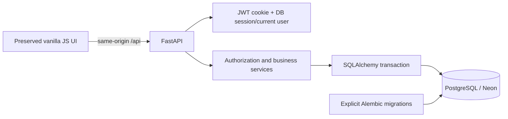
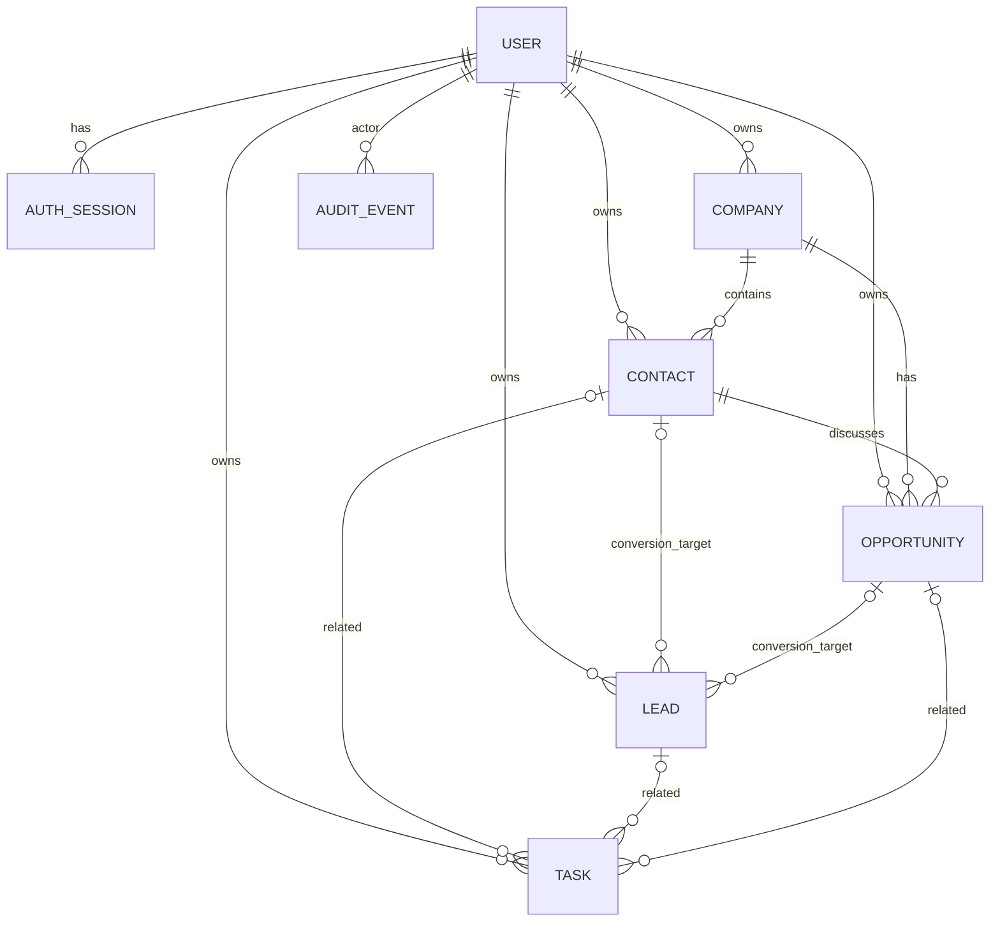

# Specification: CRM Business v2

## Business problem and AS-IS / TO-BE

A fictional web studio needs consistent customer relationships, prospects, sales opportunities, and follow-ups shared by a small team. This is a learning/portfolio project with synthetic examples and no measured business impact.

| Concern | v1 | v2 |
|---|---|---|
| Data | Browser localStorage | PostgreSQL |
| Users | One browser | DB users/sessions |
| Permissions | None | Owner/assignee and role/team |
| Company | Text field | Separate entity |
| Conversion | Client steps | One transaction |
| Metrics | JavaScript | Canonical backend formulas |
| History | Local mutable array | DB audit, protected UPDATE/DELETE |
| Hosting | Static | FastAPI + static frontend on Vercel, Neon DB |

## Architecture

Each request gets one SQLAlchemy session. Commands commit only after validation, writes, and audit succeed; exceptions rollback. Auth/handlers reuse the request session. Runtime uses NullPool with Neon's pooled connection; migrations use the direct connection. Schema creation, migration, and seed never run on request/startup/build.

Frontend loads a scoped workspace snapshot, filters/searches authorized records locally, sends typed mutations, and reloads. Analytics come from the backend. Revision numbers reject stale edits with 409. Workspace reads use READ COMMITTED and can span concurrent commits; not an atomic global snapshot.

## Roles

| Role | Visibility | Actions |
|---|---|---|
| Sales | Own OR explicitly assigned records | Authorized CRM edits/conversion/follow-up; no user/config/other-user ownership administration |
| Manager | Records owned OR assigned to own team's members | Team operations, assignment inside team, analytics; changes to others' sales outcomes/value require reason |
| Admin | All system records | User/config administration and audited CRM operations; others' outcome/value edits still require reason |

Role/active status is reloaded from DB on every request; frontend labels are not authority. Inaccessible IDs return 404. Lists, foreign references, exports, audit, and dashboard are scoped. Team is a validated string on User, not organizational multi-tenancy. One owner/assignee per record.

Company/contact owner stays fixed after creation for stable deduplication; use assignment for collaboration. Lead/deal/task owners can change through explicit commands. New deal owner must already access contact/company. Assigned contacts require assigned company access. User-management updates revoke target sessions.

## Entities / ERD

Owned records include UUID string ID, owner/assignee, created/updated UTC timestamps, revision. Opportunity value uses Numeric(16,2). Audit stores actor, entity type/id, owner/assignee/team snapshots, action, timestamp, old/new JSON, metadata. Historical audit access follows ownership snapshots, while current business data follows current owners. Auxiliary tables: auth_sessions, login_attempts, crm_config.

## Backend-enforced business rules

1. Every owned record has a valid owner. New owners/assignees must be active.
2. Company normalization: Unicode NFKC, casefold, trim, collapse whitespace. Legal suffixes/punctuation remain meaningful.
3. Contact normalization: trim/casefold validated email; empty email becomes NULL dedup key and allows multiple no-email contacts.
4. DB unique keys are `(owner_id, normalized_name/email)`. Duplicate customer identities across owners are deliberate to avoid private-record existence leaks.
5. Conversion row-locks lead and validates revision, resolves company/contact, optionally creates deal, marks converted, and audits inside one transaction. Advisory transaction locks serialize normalized key resolution; unique constraints provide a final boundary. Re-conversion returns 409.
6. Same-email contact with another company conflicts and rolls back. No silent company transfer. Assigned sales reps cannot reuse inaccessible contacts.
7. Canonical stages New/Qualification/Proposal/Negotiation/Won/Lost map to Indonesian UI labels. Direct transitions are allowed; no extra stage gating.
8. Won/Lost sets closed_at, Lost requires nonblank reason. Same-stage saves retain close time. Changing one closed outcome to another updates close time and audit.
9. Reopen clears closed_at/reason and records reopened plus stage_changed.
10. Stage/value/ownership changes produce audit; Manager/Admin modifying another owner's outcome/value must explain the change.
11. Opportunities cannot be deleted via CRUD: use Lost with reason. Converted leads are retained/read-only for history/analytics. FK-related contacts/companies cannot be deleted.
12. Overdue = incomplete task due before today's report date; today is not overdue.
13. At Risk = active opportunity with last opportunity follow-up (or created_at when none) at least configured days ago. Default 14, Admin can choose 1–365.
14. Explicit opportunity follow-up or completing an opportunity-linked task refreshes last_followup_at. Price/stage edits, future task creation, and generic contact notes do not clear opportunity risk.
15. No audit edit/delete endpoints; PostgreSQL trigger rejects UPDATE/DELETE. DB owners can still alter triggers/TRUNCATE: not a tamper-proof external ledger.

## Analytics definitions

UTC timestamps; report calendar/date boundaries use REPORT_TIMEZONE (Asia/Jakarta default). Window inclusive from today minus (days−1) to today. UI offers 30/90/365 days.

| Metric | Formula |
|---|---|
| Pipeline | Current visible active values, independent of close window |
| Won value | Visible Won values closed in chosen window, not cash received |
| Win rate | Won / (Won+Lost) closed in window ×100, rounded integer; zero if denominator zero |
| Open opportunities | Current active visible count |
| Contacts | Current visible count |
| Overdue / At Risk | Current counts using rules 12–14 |
| Conversion rate | Converted / all visible leads created in chosen window ×100; cohort-based, one decimal |
| Average sales cycle | Average elapsed created_at→closed_at days for Won in close window |
| Stage values | Current active count/value per stage |
| By rep | Current-owner pipeline and windowed Won values; assignment is not counted twice |
| Chart | Won value in six calendar months, current partial month included |
| Lead sources | All-time visible counts |

Owner transfers move current metrics to new owner. Historic ownership attribution and accounting snapshots are not implemented. Outcome/value edits can change reports but are auditable.

## REST API overview

OpenAPI: `/api/docs`, `/api/openapi.json`.

| Group | Operations |
|---|---|
| /auth | login, me, logout, demo availability |
| /users | Scoped roster; Admin create/update/deactivate/role/team/password |
| /companies, /contacts, /leads, /opportunities, /tasks | Typed list/read/create/update, authorized delete where allowed |
| /{resource}/{id}/owner | Assignment with revision and reason |
| /leads/{id}/convert | Transactional command, optional opportunity |
| /opportunities/{id}/stage | Transition with revision and reasons |
| /activities | Read history; POST explicit follow-up |
| /dashboard, /workspace | Scoped analytics/collections |
| /config | Read; Admin update |
| /backup, /backup/import | Scoped export; Admin transactional append |
| /demo/reset | Admin + demo/reset feature flags |
| /health | Minimal DB reachability |

All authenticated writes require session cookie + X-CSRF-Token. Input forbids arbitrary extra fields; clients cannot choose IDs/closed dates/audit events. PUT expects complete resource and `?revision=n`. Ownership is a separate command.

## Import/reset changes justified by multi-user migration

Backup v2 exports visible data and audit_read_only, never hashes/tokens. Import accepts v1/v2, creates new IDs/current timestamps, appends as importing Admin's ownership, and ignores imported owner/assignee/old audit/close dates. Converted leads are reconstructed through server conversion; links must match. Contacts can be reused by normalization. Invalid input rolls back everything. Maximum 500 records per collection and 5 MB app limit (provider limits can be lower).

This is data migration, not exact disaster recovery. Use PostgreSQL/Neon backups for exact restore. Reset only touches demo-owned records, keeps audit/users, reseeds examples, and requires both DEMO_MODE/ENABLE_DEMO_RESET. Non-demo foreign references can block reset transaction. Passwords/roles are not reset. Production reset should remain off.
